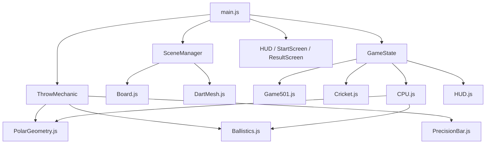
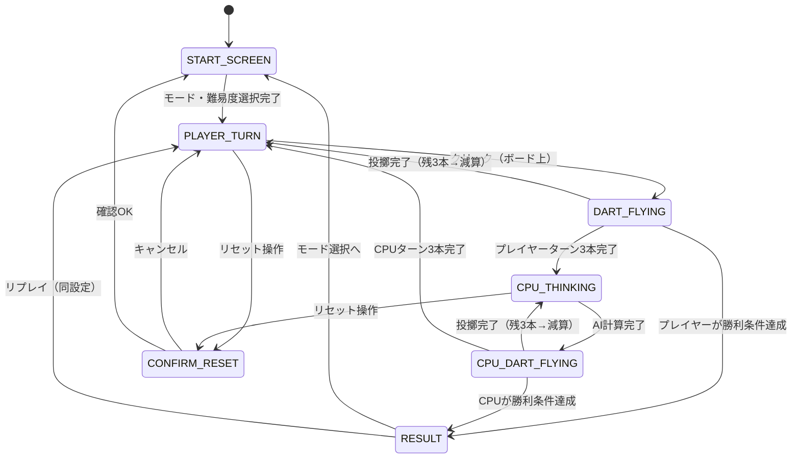

# feat: Build Web 3D Darts Game

## Overview

ブラウザで動作するシングルプレイヤー向け3Dダーツゲームをゼロからビルドする。
Three.jsで3Dシーンを描画し、ダーツの飛翔は数式による弾道計算、着弾判定は純粋な極座標計算で実装する。
501/301（カウントダウン）とクリケットの2モードをCPU AI対戦でプレイできる。

## Problem Frame

ブラウザで手軽に遊べるリアルな3DダーツゲームをインストールなしでCPU対戦できる形で提供する（see origin: `docs/brainstorms/3d-darts-game-requirements.md`）。

## Requirements Trace

- R1-R2. スタート画面でゲームモード（501/301 / クリケット）と難易度を選択できる
- R3-R5. Three.jsによる3D表示・プレイヤー視点・弾道アニメーション
- R6-R9. クリックタイミング方式の投擲操作（照準 + 精度バー + 3本/ターン）
- R10-R11. 数式弾道計算 + ダーツのボード残留 + ターン終了時に除去
- R12-R13. 全領域（シングル/ダブル/トリプル/Bull/Outer Bull）の正確な判定 + リアルタイムスコア表示
- R14-R15. 501/301ルール（交互・バスト・カジュアルフィニッシュ）
- R17-R20. クリケットルール（15-20+Bull、3ヒットでクローズ、得点・勝利条件）
- R21-R23. CPU AI（難易度3段階・アニメーション付き）
- R24-R25. リザルト画面・リプレイ・途中リセット確認

## Scope Boundaries

- オンライン対戦・ローカル2P対戦は対象外
- スマートフォン・タッチ操作最適化は対象外（PCブラウザのみ）
- キャラクターカスタマイズ・アバターは対象外
- リーダーボード・スコア永続化は対象外
- 練習モードは対象外

### Deferred to Separate Tasks

- Responsive / モバイル対応: 別イテレーション
- ハイスコアのlocalStorage保存: 別イテレーション

## Context & Research

### Relevant Code and Patterns

新規プロジェクト（コードベースは空）。以下の外部パターンに従う：

- **Three.js r150+**: ES moduleインポート（`import * as THREE from 'three'`）、`WebGLRenderer`、`PerspectiveCamera`、`Raycaster`を使用
- **Vite**: `npm create vite@latest`ベースのシンプルなVanilla JS構成。`vite.config.js`は最小構成
- **Vitest**: `import { describe, it, expect } from 'vitest'`で純粋な計算ロジックをユニットテスト

### Institutional Learnings

なし（新規プロジェクト）

### External References

- Three.js ドキュメント: Raycaster、BufferGeometry、CircleGeometry
- 標準ダーツボード寸法: BDO/WDF規格（Double Bull r=6.35mm、Bull r=15.9mm、Triple 99-107mm、Double 162-170mm）
- 数字配列（12時位置から時計回り）: 20, 1, 18, 4, 13, 6, 10, 15, 2, 17, 3, 19, 7, 16, 8, 11, 14, 9, 12, 5

## Key Technical Decisions

- **cannon-esを削除**: 着弾判定にPhysicsエンジンは不要。3D座標からボード平面への投影後、極座標（r, θ）でシングル/ダブル/トリプル/Bull領域を決定する。セグメント判定は純粋な数学で完結する（see origin: P1 finding #3）
- **精度バー常時表示方式**: プレイヤーターン中は精度バーを常時アクティブ（自動起動）にする。マウスをボード上に移動→照準レティクル表示→クリックで投擲。「照準確定」の追加アクションは不要（see origin: P0 finding #1）
- **偏差計算**: バー位置 `p ∈ [-1, 1]` → 偏差量 `|p| × MAX_DEV_RADIUS`（チューニング可）→ 偏差方向 = 一様乱数 `θ ∈ [0, 2π]`（see origin: P0 finding #2）
- **クリケットBull**: Inner Bull（r < 0.0374）= 50点・2カウント、Outer Bull（r < 0.0935）= 25点・1カウント（標準ルール）（see origin: P1 finding #4）
- **バスト時の残りダーツ**: バスト確定後は残りダーツを投げずにターンを即終了する（シンプルなUX）
- **クリケット引き分け**: 先にターンを完了した側が勝つ（交互ターン制なのでプレイヤーが先に条件を満たした場合のみ即勝利、CPUターン中に条件が成立した場合は次のプレイヤーターン開始前に勝利確認）
- **ボード外クリック**: カーソルがボード平面と交差しない場合はクリックを無視する（投擲は発生しない）
- **ビルドツール**: Vite + Vanilla JS（npmなしのCDN版も可だが開発効率のためViteを推奨）

## Open Questions

### Resolved During Planning

- **精度バーのトリガー**: プレイヤーターン開始と同時に自動で開始、クリックで投擲。追加のアクションは不要
- **偏差の方向**: ランダム方向（全方位均等）。照準点からの放射状ズレ
- **精度バーの往復速度**: 初期値は2秒/往復（難易度に関係なく固定、スキル要素として機能）
- **バスト時の残りダーツ**: 即終了（残り分は投げない）
- **クリケット引き分け**: 先に条件を満たしたプレイヤーが勝利
- **CPU AI Cricket戦略（Easy）**: ランダムに対象数字（15-20, Bull）を選択。大きな散らばり
- **CPU AI Cricket戦略（Medium）**: 未クローズの最大数字から順に狙う。中程度の散らばり
- **CPU AI Cricket戦略（Hard）**: 相手がスコア中の未クローズ数字を優先クローズ。次に得点効率の高い数字を狙う。小さな散らばり
- **CPU AI 501戦略**: 常に最大得点エリア（20のトリプル=60点）を狙い、終盤（残50点以下）は適切なフィニッシュを狙う（全難易度共通だが精度で差をつける）
- **リザルト画面コンテンツ**: 勝者名（Player / CPU）、最終スコア（501: 消化ラウンド数; Cricket: 両者得点）、リプレイ/モード選択ボタン

### Deferred to Implementation

- MAX_DEV_RADIUSの値（ゲームプレイで調整。往復速度は初期値2秒/往復に決定済み）
- CPU AIの難易度別散らばり半径の実際の数値（プレイで調整）
- ダーツボードのテクスチャ詳細（手続き生成のリングとセクターの色パレット）
- カメラのFOVとボードまでの距離の最適値

## Output Structure

    dartsGame/
    ├── index.html
    ├── package.json
    ├── vite.config.js
    ├── src/
    │   ├── main.js                    # エントリーポイント・イベント配線
    │   ├── scene/
    │   │   ├── SceneManager.js        # Three.jsシーン・カメラ・レンダラー
    │   │   ├── Board.js               # ダーツボードジオメトリ生成
    │   │   └── DartMesh.js            # ダーツの形状・アニメーション
    │   ├── game/
    │   │   ├── GameState.js           # ステートマシン・ターン管理
    │   │   ├── ThrowMechanic.js       # 照準raycasting・クリックハンドラー
    │   │   ├── Ballistics.js          # 弾道計算（放物線数式）
    │   │   ├── modes/
    │   │   │   ├── Game501.js         # 501/301ルールエンジン
    │   │   │   └── Cricket.js         # クリケットルールエンジン
    │   │   └── CPU.js                 # CPU AIロジック
    │   ├── ui/
    │   │   ├── StartScreen.js         # スタート/モード選択画面
    │   │   ├── HUD.js                 # ゲーム中スコア表示
    │   │   ├── PrecisionBar.js        # 精度インジケーターバー
    │   │   └── ResultScreen.js        # 勝敗リザルト画面
    │   └── utils/
    │       └── PolarGeometry.js       # ボード当たり判定・座標計算
    ├── tests/
    │   ├── PolarGeometry.test.js
    │   ├── GameState.test.js
    │   ├── Game501.test.js
    │   ├── Cricket.test.js
    │   └── CPU.test.js
    └── docs/
        ├── brainstorms/
        └── plans/

## High-Level Technical Design

> *このセクションは実装方針を伝えるための方向性ガイダンスであり、実装仕様書ではない。実装エージェントはコンテキストとして参照すること。*

### コンポーネント関係図



### 投擲フロー（プレイヤーターン）

```mermaid
sequenceDiagram
    participant User
    participant TM as ThrowMechanic
    participant PB as PrecisionBar
    participant Ball as Ballistics
    participant PG as PolarGeometry
    participant GS as GameState

    GS->>PB: start() — ターン開始でバー自動起動
    User->>TM: mousemove — ボード上でレティクル更新
    User->>TM: click（ボード上）
    TM->>PB: getOffset() — バー現在位置 [-1,1]
    TM->>TM: 偏差量 = |offset| × MAX_DEV; 方向 = random θ
    TM->>Ball: computeArc(origin, targetPoint + deviation)
    Ball-->>TM: keyframes[]（放物線アニメーションフレーム）
    TM->>Dart: animate(keyframes)
    Dart-->>TM: onLanded(landingPoint)
    TM->>PG: getScore(landingPoint)
    PG-->>TM: {number, multiplier, points}
    TM->>GS: recordScore(scoreInfo)
    GS->>HUD: update()
    GS->>GS: checkWin() / nextThrow() / endTurn()
```

### ゲームステートマシン



### 極座標によるスコア判定

```
入力: ボード平面上の2D座標 (x, y)（ボード中心=原点）
r = √(x² + y²) / BOARD_RADIUS  ← 正規化半径 [0, ∞)
θ = atan2(x, y)  ← 12時位置を0として時計回り [0, 2π)

領域判定（r基準）:
  r < 0.0374  → Double Bull (50pts, cricket: 2 counts)
  r < 0.0935  → Single Bull (25pts, cricket: 1 count)
  r < 0.5824  → Inner Single
  r < 0.6294  → Triple
  r < 0.9529  → Outer Single
  r < 1.0000  → Double
  r ≥ 1.0000  → Miss

数字判定（Bull以外）:
  sectorIndex = floor((θ + π/20) / (2π/20)) mod 20
  number = NUMBERS[sectorIndex]
  // NUMBERS = [20, 1, 18, 4, 13, 6, 10, 15, 2, 17, 3, 19, 7, 16, 8, 11, 14, 9, 12, 5]

点数 = number × multiplier (1|2|3)
```

## Implementation Units

- [ ] **Unit 1: プロジェクトセットアップ & Three.jsシーン基盤**

**Goal:** Vite + Three.jsの開発環境を構築し、3Dシーン（カメラ・ライト・レンダラー・アニメーションループ）の基盤を完成させる

**Requirements:** R3（Three.js使用）、R4（プレイヤー視点）

**Dependencies:** なし

**Files:**
- Create: `index.html`
- Create: `package.json`
- Create: `vite.config.js`
- Create: `src/main.js`
- Create: `src/scene/SceneManager.js`

**Approach:**
- `package.json` に `three` と `vitest` を devDependencies として追加
- `SceneManager` はシーン・カメラ・WebGLRenderer・環境光/DirectionalLightを初期化し、`resize`イベントでレスポンシブに対応する
- カメラは `PerspectiveCamera(60°, aspect, 0.1, 100)` で `position.z = 3`（ボード正面）に配置
- `requestAnimationFrame` によるレンダーループを `SceneManager.start()` で開始

**Test expectation:** none — プロジェクトセットアップ。ブラウザで空の3Dシーン（黒背景+グリッド補助線）が表示されることで手動確認

**Patterns to follow:**
- Three.js公式サンプルの最小構成: `scene` / `camera` / `renderer` の3オブジェクト分離

**Verification:**
- `npm run dev` でブラウザが開き、コンソールエラーなしにキャンバスが表示される

---

- [ ] **Unit 2: ダーツボードジオメトリ & 極座標ヒット判定**

**Goal:** 視覚的に正確なダーツボードを手続き生成し、任意の2D着弾点から得点領域（数字・倍率・点数）を返す純粋関数を実装する

**Requirements:** R3（3D表示）、R12（正確な領域判定）、R13（スコアリアルタイム表示基盤）

**Dependencies:** Unit 1

**Files:**
- Create: `src/utils/PolarGeometry.js`
- Create: `src/scene/Board.js`
- Create: `src/scene/DartMesh.js`
- Test: `tests/PolarGeometry.test.js`

**Approach:**
- `PolarGeometry.js` は Three.jsに依存しない純粋なES module。入力`(x, y, boardRadius)`で`{number, multiplier, points, region}`を返す関数`getScoreAt`を公開する
- `Board.js` は `THREE.CircleGeometry` とカスタム `BufferGeometry` を組み合わせてリング・セクター・数字ラベル（`THREE.CanvasTexture`または`THREE.Sprite`）を生成する
- ダーツボードの数字配列はモジュール定数 `SECTOR_NUMBERS = [20, 1, 18, 4, 13, 6, 10, 15, 2, 17, 3, 19, 7, 16, 8, 11, 14, 9, 12, 5]` として定義する
- `DartMesh.js` は `THREE.CylinderGeometry`（胴体）+`THREE.ConeGeometry`（先端）の合成でダーツを生成する

**Test scenarios:**
- Happy path: `getScoreAt(0, 0, r)` → `{number: 25, multiplier: 2, points: 50, region: 'double_bull'}` (ど真ん中)
- Happy path: `getScoreAt(0, 0.05, r)` → `{number: 25, multiplier: 1, points: 25, region: 'single_bull'}` (Outer Bull)
- Happy path: トリプル20の座標（r = 0.6 * boardR, θ = 0） → `{number: 20, multiplier: 3, points: 60}`
- Happy path: ダブル20の座標 → `{number: 20, multiplier: 2, points: 40}`
- Edge case: ボード外 `r > boardRadius` → `{number: 0, multiplier: 0, points: 0, region: 'miss'}`
- Edge case: セクター境界（18°境界付近のθ） → 隣接する数字のどちらかを返す（重複なし）
- Edge case: 各20数字すべてのシングル領域が正しく識別される（`SECTOR_NUMBERS`の順序検証）

**Verification:**
- すべてのユニットテストがパスする
- ブラウザでダーツボードが正しい色（黒/白交互のシングル、赤/緑のダブル・トリプル）で表示される

---

- [ ] **Unit 3: 弾道計算 & ダーツ飛翔アニメーション**

**Goal:** 投擲点から着弾点への放物線軌道を計算し、ダーツが弧を描いて刺さるアニメーションを実装する

**Requirements:** R5（弾道と着弾の3Dアニメーション）、R10（数式弾道計算）、R11（刺さった状態で表示）

**Dependencies:** Unit 2

**Files:**
- Create: `src/game/Ballistics.js`
- Modify: `src/scene/DartMesh.js`（アニメーション制御メソッドを追加）

**Approach:**
- `Ballistics.computeArc(from, to, options)` は `t ∈ [0, 1]` の配列に対して3D位置と回転を返す。弧の高さは `options.arcHeight`（デフォルト0.3）でチューニング可能
- 数式: `pos.y = lerp(from.y, to.y, t) + arcHeight × sin(π × t)`、x/zは線形補間
- `DartMesh.throwTo(keyframes, onComplete)` はアニメーションループでキーフレームを追従し、完了時に`onComplete(landingPoint)`を呼ぶ
- 着弾時のダーツの姿勢: ボード法線方向を向くように`quaternion`を設定（ボードがZ=0の場合、ダーツは-Z方向）

**Test expectation:** none — 視覚的なアニメーション。ブラウザで放物線を描いてボードに刺さることを手動確認

**Verification:**
- ダーツがフレーム落ちなく滑らかに飛翔し、ボードに対して正面から刺さる姿勢で停止する
- アニメーション中は次の投擲ができない（onComplete後に制御が戻る）

---

- [ ] **Unit 4: 投擲操作 — 照準レティクル & 精度バー**

**Goal:** マウス位置をボード上に投影して照準を表示し、精度バーのタイミングでダーツの偏差を計算してUnit 3の弾道アニメーションを起動する

**Requirements:** R6（照準）、R7（精度インジケーター）、R8（タイミングと精度の関係）、R9（3本/ターン）

**Dependencies:** Unit 3

**Files:**
- Create: `src/game/ThrowMechanic.js`
- Create: `src/ui/PrecisionBar.js`
- Modify: `src/main.js`（マウスイベント・クリックハンドラーを接続）

**Approach:**

**ThrowMechanic.js:**
- `Raycaster`でマウス座標→ボード平面交差点を計算する（`Board`のメッシュをターゲットにする）
- `onMouseMove(event)`: 交差点を更新し、レティクル（`THREE.RingGeometry`の小さなメッシュ）をボード面上に表示する。ボード外ではレティクルを非表示にする
- `onMouseClick(event)`: 現在の交差点が有効な場合のみ実行。`PrecisionBar.getOffset()`でバー位置取得→偏差計算→`Ballistics.computeArc`→`DartMesh.throwTo`を順次呼ぶ
- 偏差計算: `magnitude = |offset| × MAX_DEVIATION`（MAX_DEVIATIONは`BOARD_RADIUS × 0.15`程度）、`direction = Math.random() × 2π`

**PrecisionBar.js:**
- HTMLオーバーレイ（`position: fixed`のdiv）としてゲームキャンバスの下部に表示する
- `start()`: `Date.now()`ベースの時間でサイン波アニメーションを開始。インジケーターの表示位置を`transform: translateX()`で更新する
- `getOffset()`: 現在のバー位置を`[-1, 1]`で返す
- `stop()`: アニメーションを停止する

**精度バーの動作仕様:**
- プレイヤーターン開始時に`PrecisionBar.start()`を呼ぶ
- 往復周期: 2秒（`sin(time × π)`）
- バーが中央付近（|offset| < 0.1）: ほぼ照準通り。バーが端（|offset| > 0.8）: 大きくズレる

**Test expectation:** none — インタラクション。手動テスト: ボード上でマウスを動かすとレティクルが追随し、クリックするとバー位置に応じたズレで投擲される

**Verification:**
- ボード内でマウスを動かすとレティクルが表示される
- ボード外クリックでは何も起こらない
- バー中央クリックで高い精度、バー端クリックで大きなズレが生じる（視覚的に確認）
- ターン中3本を投げ終えると`onTurnComplete`コールバックが呼ばれる

---

- [ ] **Unit 5: ゲームステートマシン & 画面管理**

**Goal:** ゲーム全体のステート（スタート画面→ゲーム中→リザルト）を管理するステートマシンを実装し、スタート画面・リザルト画面・途中リセット確認UIを作成する

**Requirements:** R1-R2（スタート画面・モード選択）、R22（難易度選択）、R24（リザルト画面）、R25（途中リセット）

**Dependencies:** Unit 4

**Files:**
- Create: `src/game/GameState.js`
- Create: `src/ui/StartScreen.js`
- Create: `src/ui/ResultScreen.js`
- Modify: `src/main.js`
- Test: `tests/GameState.test.js`

**Approach:**

**GameState.js:**
- `STATE`列挙体を定義: `START_SCREEN | PLAYER_TURN | DART_FLYING | CPU_THINKING | CPU_DART_FLYING | CONFIRM_RESET | RESULT`
- `transition(newState)` でステート遷移を行い、各ステートの`onEnter`/`onExit`フックを呼ぶ
- `currentMode` ('501' | '301' | 'cricket')、`difficulty` ('easy' | 'medium' | 'hard')、`dartsThrown`(0-3)、`currentTurn` ('player' | 'cpu')を保持する

**StartScreen.js / ResultScreen.js:**
- HTML/CSS オーバーレイ（Three.jsキャンバスの上に重ねる）
- `StartScreen.show()`: モード選択（501/301/クリケット）と難易度選択ボタンをレンダリング。選択完了後に`onStart(mode, difficulty)`コールバックを呼ぶ
- `ResultScreen.show(winner, stats)`: 勝者・最終スコア・消化ラウンド数を表示。「リプレイ」「モード選択へ」ボタンを表示する
- 途中リセット: `GameState`がCONFIRM_RESET状態の時、「本当にやめますか？」のモーダルを表示する（HTML confirm代替のカスタムダイアログ）

**Test scenarios:**
- Happy path: `transition(PLAYER_TURN)` 後に `currentState === PLAYER_TURN`
- Happy path: `startGame({mode:'501', difficulty:'medium'})` → `currentMode === '501'`、`currentTurn === 'player'`、`dartsThrown === 0`
- Happy path: PLAYER_TURN → `onThrow()` → state は `DART_FLYING` に遷移する
- Happy path: DART_FLYING → `onLanded()` (darts=1) → state は `PLAYER_TURN` に戻る（dartsThrown===1）
- Happy path: DART_FLYING → `onLanded()` (dartsThrown===3) → state は `CPU_THINKING` に遷移し、currentTurnは'cpu'になる
- Happy path: CONFIRM_RESET → `confirmReset()` → state は `START_SCREEN`、ゲーム状態がリセットされる
- Happy path: CONFIRM_RESET → `cancelReset()` → 直前のstate（PLAYER_TURNまたはCPU_THINKING）に戻る
- Error path: DART_FLYING 中に `onThrow()` を呼んでも state 変化なし（アニメーション中は無視）

**Verification:**
- スタート画面でモードと難易度を選択してゲームが開始できる
- ゲーム中にリセットボタンを押すと確認ダイアログが出る
- OKでスタート画面に戻り、キャンセルでゲームを再開できる

---

- [ ] **Unit 6: HUD（ゲーム中スコア表示）**

**Goal:** 現在のターン・残スコア（501）またはクローズ状態（クリケット）・ダーツ残本数をリアルタイムで表示するHUDを実装する

**Requirements:** R13（リアルタイムスコア表示）、R7関連（ゲーム状態の視覚的フィードバック）

**Dependencies:** Unit 5

**Files:**
- Create: `src/ui/HUD.js`
- Modify: `src/main.js`

**Approach:**
- HTMLオーバーレイ（ゲームキャンバスの上）で実装する
- **501モードのHUD**: プレイヤー残スコア（大きく表示）| CPU残スコア | 現在ターンのダーツ別スコア（1本目: -, 2本目: -, 3本目: -）| ターン指示テキスト
- **クリケットモードのHUD**: 7数字（15-20、Bull）× 2プレイヤーのクローズ状態テーブル。各マスに「○（1hit）」「◎（2hit）」「●（closed）」を表示 | 両者の得点
- `HUD.update(gameData)`: `GameState`から必要なデータを受け取り、DOMを更新する。`gameData`には`{mode, playerScore, cpuScore, dartsThrown, dartScores[], cricketState}`を含む
- バスト発生時: 「BUST!」テキストをフラッシュ表示（CSSアニメーション0.8秒）

**Test expectation:** none — UI表示。手動テスト: 数字の更新が正確にリアルタイムで反映されることを確認

**Verification:**
- 501モードで各投擲後に残スコアと当ターンのダーツスコアが更新される
- バスト時に「BUST!」表示とスコアロールバックが行われる
- クリケットモードでクローズ状態テーブルが正しく更新される

---

- [ ] **Unit 7: ゲームモードルールエンジン（501/301 & クリケット）**

**Goal:** 501/301とクリケットのルールを実装するピュアな計算モジュールを作成し、ターン管理・スコア計算・バスト判定・勝利条件チェックをGameStateと連携させる

**Requirements:** R14-R15（501/301ルール）、R17-R20（クリケットルール）

**Dependencies:** Unit 6

**Files:**
- Create: `src/game/modes/Game501.js`
- Create: `src/game/modes/Cricket.js`
- Modify: `src/game/GameState.js`（モードインスタンスを保持・委譲する）
- Test: `tests/Game501.test.js`
- Test: `tests/Cricket.test.js`

**Approach:**

**Game501.js** (両プレイヤーの状態を保持):
- `applyThrow(player, scoreInfo)`: 減算後スコアを計算し、バスト（<0）の場合は`{bust: true}`を返す
- `checkWin(player)`: スコアがちょうど0なら`true`
- `getState()`: `{playerScore, cpuScore, history}`を返す
- バスト発生時: そのターンのスコアをすべてロールバックし、即ターン終了

**Cricket.js** (両プレイヤーの状態を保持):
- `CRICKET_NUMBERS = [15, 16, 17, 18, 19, 20, 25]`（25 = Bull）
- `applyThrow(player, scoreInfo)`: 対象数字でなければ無効。カウント加算→3カウント達成でクローズ。相手がクローズ前なら`points += number × excessCounts`
- `checkWin(player)`: 全数字クローズ かつ `myScore >= opponentScore`
- Inner Bull（region: 'double_bull'）= 2カウント扱い（50点は得点時に50点として計算）
- `getState()`: `{closeStatus: {player: {15: 0, 16: 2, ...}, cpu: {...}}, playerScore, cpuScore}`

**Test scenarios (Game501.test.js):**
- Happy path: 残501から60（T20）を3回引く → 残381
- Happy path: ちょうど0（残32からD16）→ `checkWin() === true`
- Error path: バスト（残2からシングル3以上）→ スコア変化なし、`{bust: true}`を返す
- Edge case: 残1の状態（D0は存在しないため実質バスト不可避）→ バスト
- Edge case: 残0の後にさらに投擲しようとした → 勝利済みのためモード側では何もしない

**Test scenarios (Cricket.test.js):**
- Happy path: 20を3回ヒット → クローズ状態になる
- Happy path: T20（トリプル20）1投 → 20が3カウントでクローズ
- Happy path: 相手が20未クローズ時に自分がクローズ後に20ヒット → 20点加算
- Happy path: Inner Bull（50pt, 2 counts）→ 2カウントとして処理される
- Edge case: Outer Bull（25pt, 1 count）→ 1カウントとして処理される
- Edge case: 相手が20をクローズ済みの時に自分が20をヒット → 得点なし（クローズには加算される）
- Edge case: 全数字クローズ、得点相手より低い → `checkWin() === false`
- Happy path: 全数字クローズ、得点同点以上 → `checkWin() === true`
- Integration: 引き分け判定 — プレイヤーとCPUが同一条件を満たした場合、先に完了したプレイヤーが勝利

**Verification:**
- すべてのユニットテストがパスする
- ブラウザでゲームを一局プレイし、501とクリケット両方のルールが正確に機能する

---

- [ ] **Unit 8: CPU AI**

**Goal:** 3段階の難易度でダーツボードの適切な位置を狙い、モードに応じた戦略でターンを実行するCPU AIを実装する

**Requirements:** R21（CPU目標決定と投擲シミュレーション）、R22（難易度3段階）、R23（アニメーション付き投擲）

**Dependencies:** Unit 7

**Files:**
- Create: `src/game/CPU.js`
- Modify: `src/game/GameState.js`（CPUターン起動・完了フックを追加）
- Test: `tests/CPU.test.js`

**Approach:**

**CPU.js:**
- `selectTarget(mode, gameState, difficulty)`: ゲームモードと状態から最適な目標数字と照準点を決定する
  - **501 - 全難易度**: 残スコア > 60 → Triple 20を狙う。残スコア ≤ 60 → チェックアウト可能な組み合わせから最善を選ぶ（D20, D16, Bull等）
  - **クリケット - Easy**: ランダムに未クローズ数字（15-20, Bull）を選択
  - **クリケット - Medium**: 未クローズの最大数字（20→19→…→15→Bull）を狙う
  - **クリケット - Hard**: 相手がスコア中の自己未クローズ数字を優先クローズ、次に得点効率最大化
- `simulateThrow(targetPoint, difficulty)`: 目標点に難易度別の散らばりを加えて着弾点を返す
  - Easy: MAX_DEV × 0.8（大きな散らばり）
  - Medium: MAX_DEV × 0.4
  - Hard: MAX_DEV × 0.15（精度が高い）
  - 方向は`PolarGeometry.js`と同じランダム方向適用
- `executeTurn(callback)`: 「思考中」UIを0.8秒表示後、3本を順次アニメーション付きで投げる。各投擲間に0.5秒の間隔を挟む。完了後に`callback()`を呼ぶ

**Test scenarios (CPU.test.js):**
- Happy path 501: 残スコア501, Easy → 選択座標はDouble Bull～T20領域内（高得点エリア）
- Happy path 501: 残スコア32, 全難易度 → 選択はD16付近（32のチェックアウト）
- Happy path クリケット Easy: 未クローズ数字（15-20, Bull）の中からランダムに返す
- Happy path クリケット Medium: 未クローズ最大数字を返す（例: 15,18クローズ済み→20を返す）
- Happy path クリケット Hard: 相手が19をスコア中かつ自己未クローズ → 19を返す
- Edge case: 全数字クローズ済み（勝利判定後） → AIは呼ばれない（GameStateで先にチェック）

**Verification:**
- すべてのユニットテストがパスする
- CPUが「CPU番...」表示後にアニメーション付きで投擲する
- クリケットでCPUが適切な戦略で目標を選択している（Hard: 画面で観察可能）
- ゲームが完走する（どちらかが勝利してリザルト画面に遷移する）

## System-Wide Impact

- **Interaction graph:** `GameState`がすべてのモジュールのオーケストレーターになる。状態遷移のたびにHUD・PrecisionBar・ThrowMechanic・CPU・画面の有効/無効が切り替わる
- **Error propagation:** Raycasting失敗（ボード外クリック）は`ThrowMechanic`で無視する。ゲームロジックの例外はコンソールエラーとして記録し、プレイヤーには「エラーが発生しました。リセットしてください」を表示する
- **State lifecycle risks:** `DART_FLYING`中にクリックを受け付けると多重投擲が発生する。`ThrowMechanic`はアニメーション中フラグ（`isAnimating`）でクリックを無効化する
- **API surface parity:** CPU AIは`ThrowMechanic`と同じ`Ballistics.computeArc` + `DartMesh.throwTo`を使用するため、投擲アニメーションが同一コードパスを通る
- **Integration coverage:** ゲームの完走テスト（プレイヤー→CPU→勝利→リザルト→リプレイ）は手動でブラウザ確認する

## Risks & Dependencies

| Risk | Mitigation |
|------|------------|
| 精度バーの往復速度が速すぎ/遅すぎてゲームにならない | 速度を定数化し、実プレイ後に調整する |
| CPU AIの散らばりパラメーターが難易度差を生まない | 各難易度でテストプレイし、数値を再調整する |
| Three.jsのRaycastingがボードメッシュと一致しない | `Board.js`のジオメトリを`Raycaster`対象として明示的に設定する |
| ブラウザのフレームレートが低くアニメーションがぎこちない | `requestAnimationFrame`のdelta timeを使い、60fps以外の環境でも同一速度になるよう補正する |
| クリケットの勝利条件チェックのタイミングがずれる | 各投擲後ではなく、3本目の`onLanded`コールバック内で一度だけチェックする |

## Documentation / Operational Notes

- ローカル開発: `npm install && npm run dev`でhttp://localhost:5173を開く
- テスト実行: `npm test`（Vitest）
- ビルド: `npm run build`でdistにバンドル出力（静的ホスティングに配置可能）
- cannon-esはこのプランから完全に削除した。着弾判定は`PolarGeometry.js`の純粋な数学関数で実装する

## Sources & References

- **Origin document:** [docs/brainstorms/3d-darts-game-requirements.md](docs/brainstorms/3d-darts-game-requirements.md)
- BDO/WDF 標準ダーツボード寸法: Double Bull 6.35mm, Bull 15.9mm, Triple 99-107mm, Double 162-170mm
- Three.js Raycaster公式ドキュメント: https://threejs.org/docs/#api/en/core/Raycaster
- 数字配列: 20, 1, 18, 4, 13, 6, 10, 15, 2, 17, 3, 19, 7, 16, 8, 11, 14, 9, 12, 5（BDO標準）
